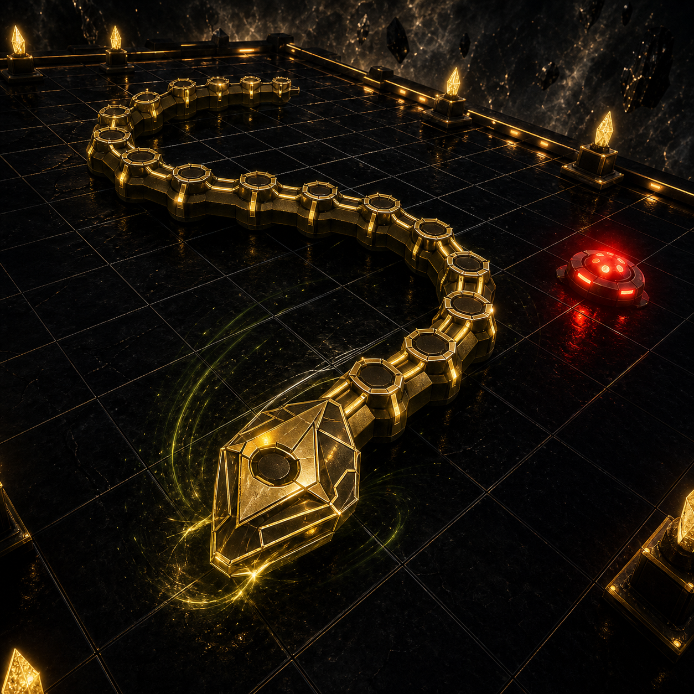

# The Impossible Snake



A cinematic 3D reinvention of Snake. Guide a biomechanical serpent through ten escalating arenas, collect energy cores, evade hunters, and use Aegis, Fang, and Phase boosters to survive.

## Features

- Ten levels with distinct speed, obstacle, and hunter configurations
- Three visually distinct boosters with reactive music and effects
- Configurable keyboard controls, player name, lives, BGM, and SFX
- Responsive desktop, tablet, portrait-mobile, and landscape-mobile layouts
- Pause, life-lost, game-over, level-clear, and victory states
- Separate standalone, Poki SDK, and CrazyGames SDK builds
- Rewarded revive and natural midgame ad placements in platform builds
- Privacy-safe local high scores and engagement diagnostics

## Controls

- Desktop: WASD or Arrow keys to steer; Space to pause or resume
- Mobile: swipe on the arena or use the direction pad
- Menus: mouse, touch, or keyboard navigation

## Tech Stack

- React 18
- Three.js and React Three Fiber
- Drei and React Three Postprocessing
- Vite 5
- Web Audio API
- Poki SDK and CrazyGames SDK v3 platform adapters

## Development

```powershell
npm ci
npm run dev
```

## Release Builds

```powershell
# SDK-free build for itch.io or private review
npm run build:standalone
npm run package:standalone

# Poki-only SDK build
npm run build:poki
npm run package:poki

# CrazyGames-only SDK build
npm run build:crazygames
npm run package:crazygames
```

Generated archives are written to `releases/` and are excluded from Git. See [PUBLISHING.md](PUBLISHING.md) for lifecycle events, ad behavior, analytics, and review checklists. Submission copy and controls are in [SUBMISSION.md](SUBMISSION.md).

